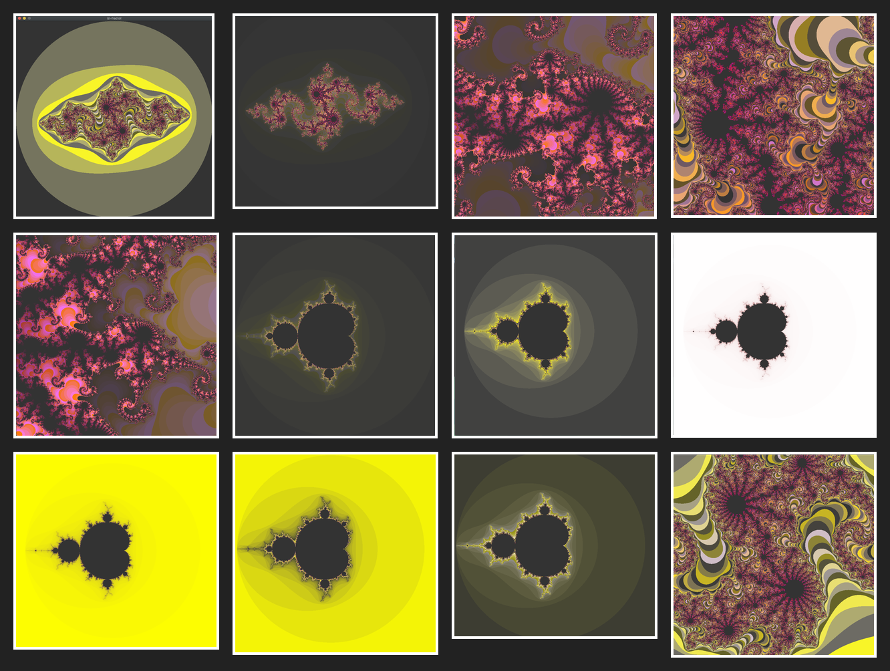

# fract-ol

**Interactive Fractal Explorer (Mandelbrot & Julia Sets)**

`fract-ol` is a lightweight C program that renders and explores the Mandelbrot and Julia fractal sets in real time.
It uses the MLX42 graphics library to provide smooth zooming, panning, and parameter tweaking.

---



---

## Table of Contents

- [Features](#features)
- [Installation](#installation)
- [Usage](#usage)
- [Controls](#controls)
- [Screenshots](#screenshots)

---

## Features

- **Mandelbrot set** rendering
- **Julia set** rendering with user‐defined complex parameter
- Infinite **zoom**
- **Color mapping** based on iteration depth
- Responsive pan & reset
- Graceful exit via `ESC` or window close

---

## Installation

1. **Clone the repository**
   ```bash
   git clone https://github.com/ilies1511/fract-ol.git
   cd fract-ol
   ```

2. **Install dependencies**
   - [MLX42](https://github.com/codam-coding-college/MLX42.git)

3. **Build**
   ```bash
   make
   ```

---

## Usage

```bash
./fractol [mandelbrot] | [julia <real> <imag>]
```

- **Mandelbrot**
  ```bash
  ./fractol mandelbrot
  ```
  Renders the classic Mandelbrot set.

- **Julia**
  ```bash
  ./fractol julia <real-part> <imag-part>
  ```
  **Valid range:**
  ```
  -2.0 ≤ real-part ≤ 2.0
  -2.0 ≤ imag-part ≤ 2.0
  ```

Invalid or missing arguments will print usage instructions.

---

## Controls

| Action            | Key / Mouse           |
|-------------------|-----------------------|
| Zoom In / Out     | Mouse wheel           |
| Pan View          | Arrow keys            |
| Exit              | `ESC` or window close |

---

## Screenshots

<p float="left">
  
  
</p>

> For a single image gallery, supply individual files in `./images/`.

---
